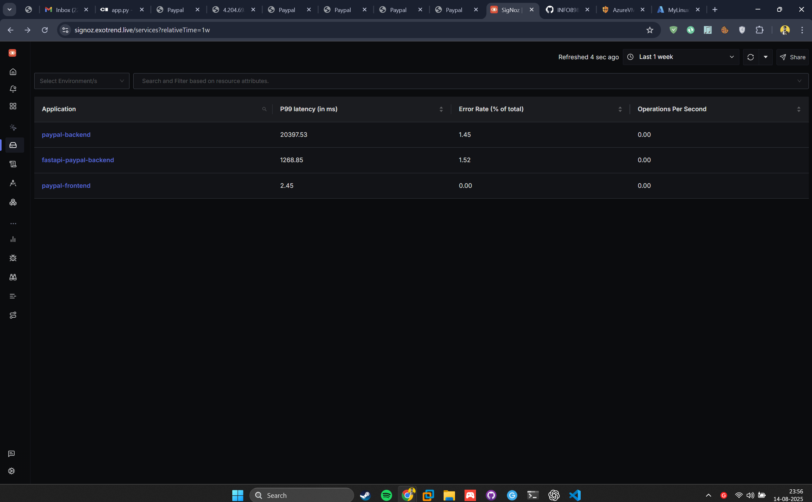
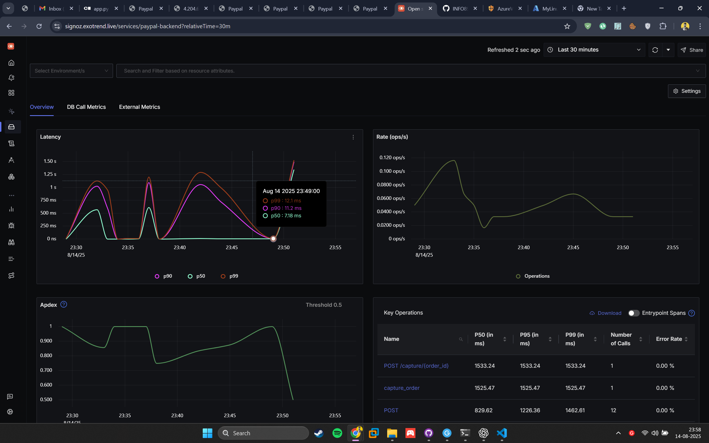

# FastAPI × React Microfrontends with OpenTelemetry

## Running it locally

### Backend (FastAPI)

```bash
# optional: create a venv (see "Python venv" below)
python3 -m venv .venv
source .venv/bin/activate

pip install -r requirements.txt
uvicorn app:app --host 0.0.0.0 --port 8080
```

Quick checks:

```bash
which python  # .../.venv/bin/python
python -V
```

## Environment variables

- **Frontend:** `VITE_OTLP_BASE` (defaults to `/otel`)
- **Backend:** `OTEL_EXPORTER_OTLP_TRACES_ENDPOINT` (defaults to `http://4.204.69.86:4318/v1/traces`)
- **Payments:** `PAYPAL_CLIENT_ID`, `PAYPAL_CLIENT_SECRET` (set these in `.env` for FastAPI)




